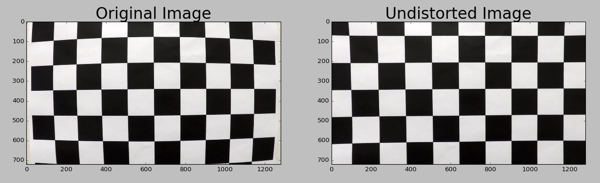
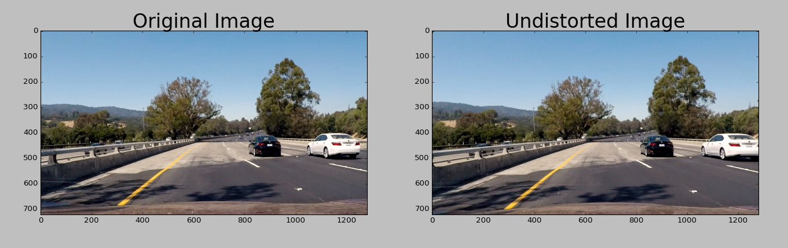
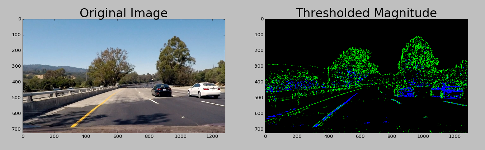
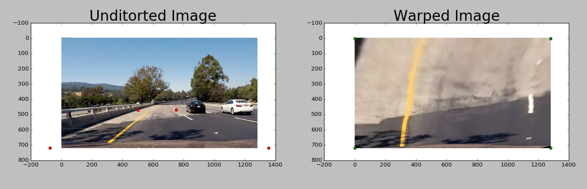

# Carnd-P4: Advanced Lane Finding (In Progress ...)
A software pipeline to identify the lane boundaries in video from a front-facing camera on a car.
The camera calibration images, test road images, and videos are available in this [repository](https://github.com/udacity/CarND-Advanced-Lane-Lines).

### Camera Calibration
OpenCV functions or other methods are used to calculate the correct camera matrix and distortion coefficients using the calibration chessboard images provided in the repository.

Compute the camera calibration matrix and distortion coefficients given a set of chessboard images (in the camera_cal folder in the repository).

### Pipeline (single images)
for a series of test images (in the test_images folder in the repository):

* Apply the distortion correction to the raw image.
* Use color transforms, gradients, etc., to create a thresholded binary image.camer
* Apply a perspective transform to rectify binary image ("birds-eye view").
* Detect lane pixels and fit to find lane boundary.
* Determine curvature of the lane and vehicle position with respect to center.
* Warp the detected lane boundaries back onto the original image.
* Output visual display of the lane boundaries and numerical estimation of lane curvature and vehicle position.

#### Apply Distortion
The funciton is impletmented in [camera_cal.py](camera_cal.py). calibrate_camera() takes in numbers of corners in x and y directions and save the calibration matrix result in file camera_cal/camera_dist.p. The funtion uses provided images in camera_cal/calibraion*.jpg to caculate the results. undistort() function uses the saved calibration matrix to undisotrt the image.

Here are examples for undistorting an image.

python3 camera_cal.py --undistort camera_cal/calibration1.jpg:


python3 camera_cal.py --undistort test_images/test4.jpg:


#### Use Color Transforms
The function is impletmented in [color_pipe.py](color_pipe.py). color_pipeline takes in an input image and covert it to HLS color space. The lightness chanell is extrated and applied the Sobel in X direction with threshold between (20, 100), and scaled to between (0. 255), and becomes mask1. Extrat the saturation channel from the color space, applied threshold between (170, 255), and became mask2. Combine mask1 and mask2 to form the color_piplne process.

Here is an example for color pipeline process.

python3 color_pipe.py --colored test_images/test4.jpg:

Note: for debugging purpose, the green color shows mask1, and blue mask2. As you can see, combined mask1 and mask2 shows a longer left lane line.

#### Apply a Perspective Transform (Birds-eye View)
The function is implemented in [warp.py](warp.py). warp_image() takes in an inputer image, source points, and destination points and warp the image into the perspective "birds-eye view." The function will return the inversed transform matrix for un-warping the image.

Here is an example for perspective transform.

python3 warp.py --warp test_images/test4.jpg:

Here we want to make sure lef and right land lines are parallel by adusting the source points (in red dots).

#### Detect Lane Pixels and Fit to Find Lane Boundary
The function is implemented in [pipeline.py](pipeline.py). pipleline.py is the main file that apply all the sub-pipelines. After applying calibration, thresholding, and a perspective transform, we should have a binary image where teh lane lines stand out clearly. Next step is to find out exactly which pixels belong to the left line and which belong to the right line. The technique used here is to find peaks in a histogram.

First take a histogram alon all the columns in teh lower part of the image:
```
histogram = np.sum(img[img.shape[0]/2:,:], axis=0)
```
Then find the two peaks representing the left and right lines x locations. Build find boxs around the locations to find non-zero pixels, and use the pixels to fit a second order polynomial for left and right lines, repsectively. The Line class in line.py is uesd for line information.

detect_line_image() takes in an input image and detect the lane lines. There are two way of detecting lane lines:
 * detect_lines_sliding_window() detects lane lines from the scratch using histogram.
 * detect_lines_previous detects lane lines with information infered from the previous detection.

The basic logic is to use detect_lines_sliding_window() at the beginning frames, which will take longer time, and then use that information to get the region of interest to use detect_lines_previous() for detecting line to save time. If detect_lines_previous() failed to obtain a good line, detect_lines_sliding_window() is used again from the scratch.

There are three methods used to determind if lines detected are good. The methods are implemented line.py inside Line class. check_line parallel() checks if two lines are parallel. check_similar_curvatures checks if two lines have similar curvatures, and check_distance checks if two lines have the distance.

#### Determine Curvature of The Lane and Vehicle Position with Respect to Center
Line class get_curvatgure_radius() calculates the lane curvature from the fitted line. You can find [a curvature tutorial here](http://www.intmath.com/applications-differentiation/8-radius-curvature.php). get_off_center_as_left() calculates the center position of the car. The function asumes the center x location is at pixcel number 805, and lane width is 950-pixel wide. The left line x position (at y in image bottom) is used to calculate the car center location. The unit is coverted to meter using the ratial of 3.7/700 meters per pixel.


### Pipeline (video)
After testeing pipline in static images, now it's time to apply the pipline to video.
